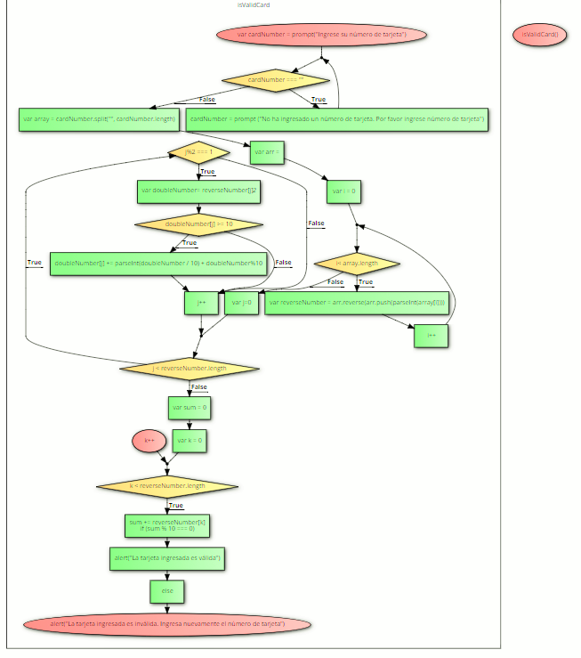

# TARJETA DE CRÉDITO VÁLIDA

Para llevar a cabo este procedimiento usaremos el Algoritmo de Luhm de la siguiente manera:

###### *Creamos una función denominada function isValidCard()*

La cual va a contener nuestro procedimiento de la siguiente manera:

Creamos una variable denominada *cardNumber* para solicitar al usuario el número de tarjeta, condicionando el no dejar el campo vacío.

        var cardNumber = prompt("Ingrese su número de tarjeta");
          while (cardNumber === "") {
           cardNumber = prompt ("No ha ingresado un número de tarjeta. Por favor ingrese número de tarjeta");}

##### Iniciacion el "algoritmo de Luhn":

1.Nos pide invertir el orden de los dígitos por lo que utilizaremos el métono "split" y luego "push" hacia un arr vacío que contenga los nuevos datos invertidos

    var array = cardNumber.split("", cardNumber.length);
    var arr = [];

2.Por medio del método for y el método push crearemos una nueva variable denominada *var reverseNumber* donde obtenemos los números invertidos

      for( var i = 0; i< array.length; i++){

    var reverseNumber = arr.reverse(arr.push(parseInt(array[i])));

3.EL algoritmo de Luhn nos indica que una vez invertido el orden de los dígitos; se debe detectar los dígitos en la posición impar y éstos multtiplicarlos por 2

      for (var j=0; j < reverseNumber.length; j++) {
        if (j%2 === 1){
    var doubleNumber= reverseNumber[j]*2;

4.Una vez realizada dicha multiplicación, los números compuestos por 2 dígitos o mayores o iguales a 1o, se debe sumar los dígitos que lo comprenden

        if(doubleNumber[j] >= 10) {
       doubleNumber[j] += parseInt(doubleNumber / 10) + doubleNumber%10;

5.Procedemos a realizar la suma de todos los dígitos que componen el último arreglo

    var sum = 0;
      for (var k = 0; k < reverseNumber.length; k++){
        sum += reverseNumber[k]

6.Donde dicha suma debe ser divisible entre 1o de manera exacta para poder identificar que la tarjeta es correcta, de lo contrario será incorrecta.

        if (sum % 10 === 0){
           alert("La tarjeta ingresada es válida");

7.De lo contrario:

           else{
           alert("La tarjeta ingresada es inválida. Ingresa nuevamente el número de tarjeta");
        break;
